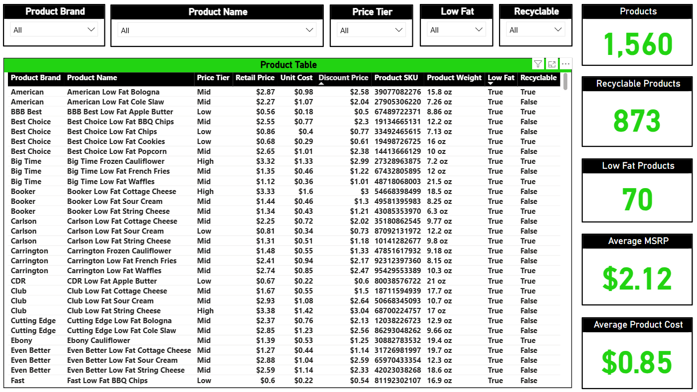
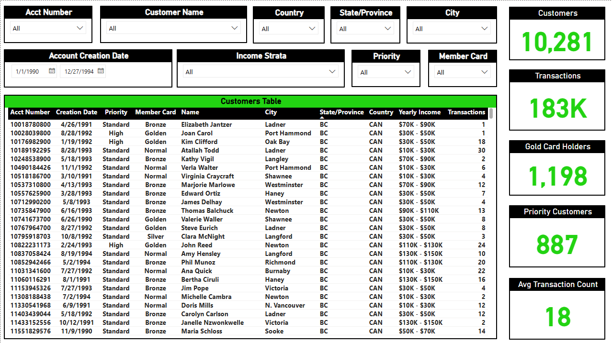
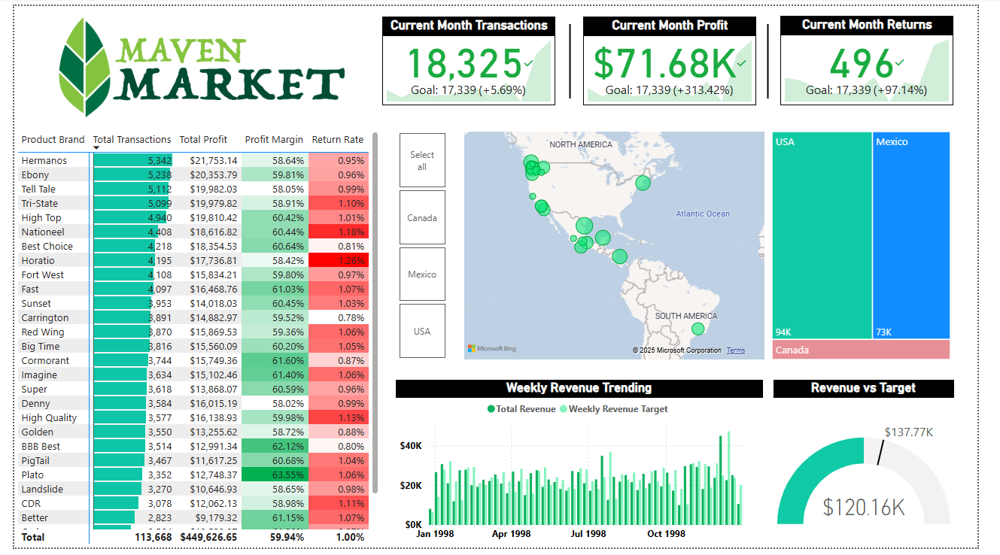

# 🛒 Maven Market Power BI Dashboard

## 📖 Overview
The **Maven Market Dashboard** is a professional Power BI project built to demonstrate end-to-end data analysis, modeling, and visualization capabilities.  
It analyzes a fictional retail dataset containing product, customer, and transaction data — providing insight into **sales performance, profit trends, product attributes, and customer segmentation**.

This project was designed as a **portfolio showcase** to illustrate practical Power BI skills, including:
- Data modeling & relationships
- DAX measures and calculated columns
- Interactive visuals and slicers
- KPI cards and gauge charts
- Hierarchical filtering and drill-through pages

---

## 🧩 Project Pages

### 🧱 **1. Product Lookup**

**Purpose:**  
Search and filter product details by brand, name, or category attributes.

**Highlights:**
- Slicers for Product Brand, Price Tier, Low Fat, and Recyclable
- KPIs for total products, recyclable count, low-fat count, average MSRP, and cost
- Interactive data table with conditional sorting

---

### 👥 **2. Customer Lookup**

**Purpose:**  
Analyze customer demographics, income brackets, and membership priorities.

**Highlights:**
- Slicers for Account Number, Name, Country, State, and Priority
- KPIs for total customers, transactions, gold members, and priority customers
- Average transaction count per customer
- Date range filter for account creation

---

### 💹 **3. Revenue Performance Dashboard**

**Purpose:**  
Track overall business performance and financial health.

**Highlights:**
- KPIs for transactions, profit, and returns vs. monthly goals
- Region map visualization (Canada, USA, Mexico)
- Weekly revenue trend chart
- Revenue vs. Target gauge
- Profit margin heatmap by brand

---

## 🧮 Tools & Skills Demonstrated
| Category | Tools / Techniques |
|-----------|--------------------|
| **Data Preparation** | Power Query Editor |
| **Data Modeling** | Star schema design, relationships, calculated columns |
| **DAX Measures** | KPIs, averages, conditional logic, targets vs actuals |
| **Visualization** | Power BI visuals (cards, tables, maps, gauge, tree map) |
| **Interactivity** | Slicers, filters, drill-through pages |
| **Design** | Consistent branding, layout alignment, conditional formatting |

---

## 📊 Key Insights
- **Profit Margin:** Averaged 59.9% across all brands.  
- **Top Brand Performance:** “Hermanos” and “Ebony” led sales volume and total profit.  
- **Regional Analysis:** The U.S. produced the highest total transactions, followed by Mexico and Canada.  
- **Customer Insights:** Gold and Priority members represented the highest transaction frequency.

---

## 🚀 How to Use
1. Download the `.pbix` file from the `/pbix` folder.  
2. Open it with **Power BI Desktop**.  
3. Use the slicers and filters on each page to explore data interactively.

> 🧠 *Note:* All data used in this project is sample or anonymized data provided as part of the Maven Market dataset.

---

## 📂 Repository Structure
